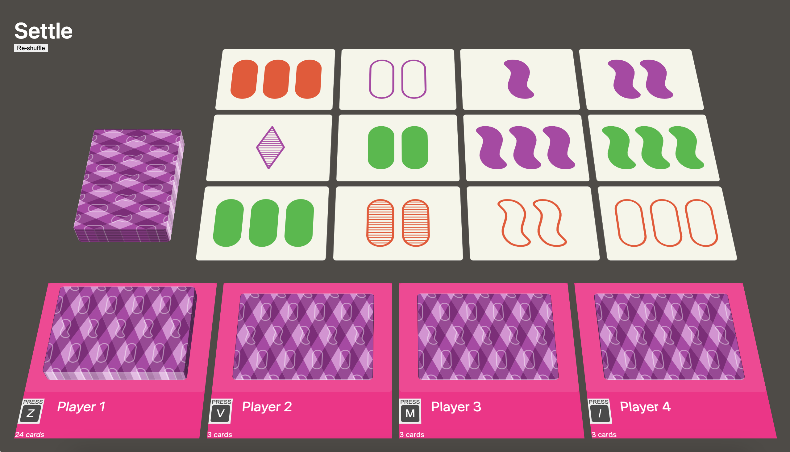

# Settle

Settle is a card game similar to Set. This is still a **work-in-progress**, and design/functionality hasn't been finalized.

[Settle WIP on Cloudflare Pages](https://settle.pages.dev/)

My requirements.

- Multiplayer, like the real game
- Nicely designed, easy to use
- Accessible and keyboard navigable
- Tiny page weight (Can I make the whole thing in <200KB?)
- 3D, with animated cards that fly around

[My Mastodon post and thread outlining my process](https://indieweb.social/@stephenjbell/111625207357581760)
